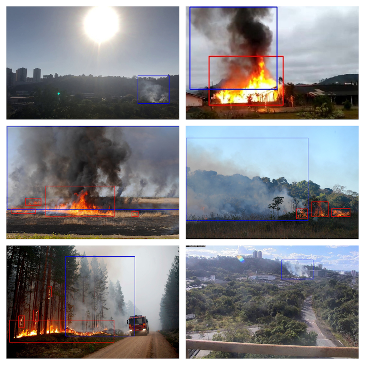

# 🔥 Wildfire Detection – Fighting Fires with AI  
Welcome to the **Wildfire Detection Research** repository! Here, we're on a mission to revolutionize wildfire prevention using the power of **computer vision**. Our research focuses on training an advanced **object detection model** to accurately spot fire and smoke in images—because early detection can mean the difference between safety and disaster.  

  

## 🚀 Highlights:

- **🔥 Fire Detection with YOLOv8** – We trained a cutting-edge YOLOv8 model using the **D-Fire dataset** for highly accurate fire and smoke detection.  
- **📊 Performance Optimization** – Explored different model sizes to find the best balance between speed and accuracy.  
- **🖥️ Interactive Web App** – Developed a **Streamlit-powered demo** so you can test the model in real-time.  
- **🔍 Future Potential** – Investigated how AI-driven wildfire detection could reshape prevention strategies worldwide.  

👉 **Dive deeper into our research!** Check out our full breakdown, methodology, and results in this Medium article:  
[Stay Ahead of the Flames: A Comprehensive Guide to Wildfire Prevention with YOLOv8](https://medium.com/institute-of-smart-systems-and-ai/stay-ahead-of-the-flames-a-comprehensive-guide-to-wildfire-prevention-with-yolov8-3eb8edd1121a)  

---

## 📂 Dataset – D-Fire 🔥  
To build a robust model, we leveraged the **[D-Fire dataset](https://github.com/gaiasd/DFireDataset)**—a **massive collection of 21,000 labeled images**, meticulously annotated in YOLO format. It includes:  

✅ **Fire & Smoke Instances** – Clearly labeled occurrences for precise detection.  
✅ **Challenging Visuals** – Non-fire images that mimic flames, ensuring robustness.  
✅ **Diverse Scenarios** – Different environments and lighting conditions for real-world applicability.  

  

  D-Fire dataset examples

  

---  

We have explored many different datasets. Here is the summary:

| Dataset                                                                                                                                                                                    | Image type      | Camera                               | \# images                                                                          | Classes                                                                                             | Bounding Boxes |
| ------------------------------------------------------------------------------------------------------------------------------------------------------------------------------------------ | --------------- | ------------------------------------ | ---------------------------------------------------------------------------------- | --------------------------------------------------------------------------------------------------- | -------------- |
| [Wildfire Detection Image Data](https://www.kaggle.com/datasets/brsdincer/wildfire-detection-image-data)                                                                                   | RGB             | Regular                              | 1,875 images                                                                       | \- fire \- no fire                                                                               | no             |
| [Fire Detection Using Surveillance Camera on Roads](https://www.kaggle.com/datasets/tharakan684/urecamain)                                                                                 | RGB             | Surveillance Camera                  | 10,000 images                                                                      | \- fire \- no fire                                                                               | no             |
| [FIRESENSE](https://www.kaggle.com/datasets/chrisfilo/firesense) (Videos)                                                                                                                  | RGB             | Regular, Surveillance Camera         | 11 fire videos 16 non-fire videos  13 smoke videos 13 non-smoke videos | \- fire \- no fire \- smoke \- no smoke                                                    | no             |
| [Aerial Rescue Object Detection](https://www.kaggle.com/datasets/julienmeine/rescue-object-detection)                                                                                      | RGB             | Regular, drone                       | 29,810 images                                                                      | \- human \- fire \- vehicle                                                                   | yes            |
| [Fire detection dataset](https://www.kaggle.com/datasets/jimishpatel/fire-detection-dataset)                                                                                               | RGB             | Regular, Surveillance Camera         | 3,894 images                                                                       | \- fire \- no fire                                                                               | no             |
| [Forest Fire](https://www.kaggle.com/datasets/kutaykutlu/forest-fire)                                                                                                                      | RGB, Gray Scale | Regular, Drone, Surveillance Camera  | 15,800 images                                                                      | \- fire \- smoke                                                                                 | no             |
| [Forest Fire Images](https://www.kaggle.com/datasets/mohnishsaiprasad/forest-fire-images)                                                                                                  | RGB             | Regular                              | 5,000 images                                                                       | \- fire \- no fire                                                                               | no             |
| [Fire Detection in YOLO format](https://www.kaggle.com/datasets/ankan1998/fire-detection-in-yolo-format)                                                                                   | RGB             | Regular                              | 500 images                                                                         | \- fire                                                                                             | yes            |
| [FLAME 2: FIRE DETECTION AND MODELING: AERIAL MULTI-SPECTRAL IMAGE DATASET](https://ieee-dataport.org/open-access/flame-2-fire-detection-and-modeling-aerial-multi-spectral-image-dataset) | RGB, IR         | Drone                                | 53,451 RGB 53,451 IR                                                            | \- fire and smoke \- fire and no smoke \- no fire and smoke \- no fire and no smoke        | no             |
| [Forest Fire Dataset](https://www.kaggle.com/datasets/alik05/forest-fire-dataset)                                                                                                          | RGB             | Regular                              | 1,900 images                                                                       | \- fire \- no fire                                                                               | no             |
| [Open Wildfire Smoke Datasets](https://github.com/aiformankind/wildfire-smoke-dataset/tree/master)                                                                                         | RGB             | Surveillance Camera                  | 2,192 images                                                                       | \- smoke                                                                                            | yes            |
| [AIDER: Aerial Image Database for Emergency Response applications](https://github.com/ckyrkou/AIDER/tree/master)                                                                           | RGB             | Aerial view, regular                 | 500 images for each disaster class 4,000 images for the normal class            | \- Fire/Smoke \- Flood \- Collapsed Building/Rubble \- Traffic Accidents \- Normal case | no             |
| [Furg Fire Dataset](https://github.com/steffensbola/furg-fire-dataset)                                                                                                                     | RGB             | Regular                              | 21 videos                                                                          | \- fire                                                                                             | yes            |
| [Mivia Fire Detection](https://mivia.unisa.it/datasets/video-analysis-datasets/fire-detection-dataset/)                                                                                    | RGB             | Regular                              | 14 fire videos 17 non-fire videos                                               | \- fire \- no fire                                                                               | no             |
| [FireNet](https://github.com/OlafenwaMoses/FireNET)                                                                                                                                        | RGB             | Regular                              | 500 images                                                                         | \- fire                                                                                             | yes            |
| [FIRE Dataset](https://www.kaggle.com/datasets/phylake1337/fire-dataset)                                                                                                                   | RGB             | Regular                              | 755 outdoor-fire images  244 nature images                                      | \- fire \- no fire                                                                               | no             |
| [Fire Detection v2](https://universe.roboflow.com/yi-shing-group-limited/fire-detection-v2-yn3wz)                                                                                          | RGB             | Regular                              | 600 images                                                                         | \- scale1fire \- scale2fire \- scale3fire                                                     | yes            |
| [fireDetection Computer Vision Project](https://universe.roboflow.com/school-tvtyg/firedetection-xxwxc)                                                                                    | RGB             | Regular                              | 9,681 images                                                                       | \- Fire \- fire                                                                                  | yes            |
| [D-Fire](https://github.com/gaiasd/DFireDataset)                                                                                                                                           | RGB             | Regular, Aerial, Surveillance Camera | 21,000 images                                                                      | \- Fire \- Smoke                                                                                 | yes            |
| [Fire-Smoke-Dataset](https://github.com/DeepQuestAI/Fire-Smoke-Dataset)                                                                                                                    | RGB             | Regular                              | 3,000 images                                                                       | \- Fire \- Smoke \- Neutral                                                                   | no             |

---

Here’s a more engaging and dynamic version of your README section:  

---

## 🚀 Model Training  

We powered up YOLOv8 by [Ultralytics](https://github.com/ultralytics/ultralytics) and trained it on the D-Fire dataset to create a fast and reliable fire and smoke detection system. But we didn’t stop at just accuracy—we fine-tuned model parameters and hyperparameters to squeeze out maximum efficiency and speed. 🔥  

💡 **Want to see how we trained it?** Check out our **[training-recipes folder](training-recipes)** for a step-by-step breakdown!  

---  

## 📊 Results  

The results? 🔥🔥🔥 The trained YOLOv8 model delivered impressive accuracy on the D-Fire test dataset, achieving strong mAP@50 scores while maintaining rapid inference speeds. Below is a snapshot of its performance (evaluated on an NVIDIA A100-SXM4-40, with 640x640 input resolution):  

| Model Size  | mAP@50 🎯 | Inference Time ⚡ (ms) |  
|-------------|--------|----------------|  
| Nano        | 0.787  |     0.422      |  
| Small       | 0.798  |     0.773      |  
| Medium      | 0.801  |     1.532      |  
| Large       | 0.812  |     2.342      |  
| Extra Large | 0.814  |     3.465      |  

🔍 **Curious about how we did it?** We’ve got you covered! Check out our deep dive:  
📖 **[Stay Ahead of the Flames: A Comprehensive Guide to Wildfire Prevention with YOLOv8](https://medium.com/institute-of-smart-systems-and-ai/stay-ahead-of-the-flames-a-comprehensive-guide-to-wildfire-prevention-with-yolov8-3eb8edd1121a)**  

---  

## 📜 License  

This project is open-source and licensed under the [MIT License](https://github.com/git/git-scm.com/blob/main/MIT-LICENSE.txt). Feel free to use, modify, and contribute! 🚀  

---
